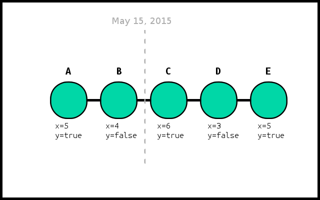

The 2git project is an SCM migration engine that enables you to migrate to git using a Groovy DSL.
{: .cuff}

## Introduction

2git is a Groovy DSL, a small language that is designed to describe what you want to migrate - from a source VCS to git.

You write your migration recipe and feed it into the 2git engine, which will then execute your migration, resulting in your git repository.

If you don't like what you see, you can easily tweak your recipe and run it again, until you get the perfect migration.

## Workflow

Independent of the source or target VCS, 2git follows a simple migration workflow.
The 2git DSL is used to build up a migration plan, which is then executed by the migration engine. 

 * Build a migration plan
   1. Select source snapshots matching defined criteria
   2. Assign actions to selected snapshots
 * Execute the migration plan
   1. Check out the next source snapshot
   2. Execute the snapshot's assigned actions
   3. Repeat

### Building the migration plan

The migration plan is built by defining filters in the 2git DSL. 


*Filters* are used to structure your migration plan, they can contain `criteria`, `extractions`, `actions` and child `filters`.


*Criteria* are used to select your source's snapshots (commits, baselines, etc.). 
Snapshots that match a filter's criteria will have that filter's extractions and actions mapped to it in the migration plan.

_Examples:_ Created after a certain date, commit message matches a regex... 


*Extractions* are executed per snapshot during the actual migration to extract metadata which can be used in the actions.

_Examples:_ Read a file's contents from your workspace, read certain commit attributes...  


*Actions* are executed per snapshot during the migration to perform various actions. This is where the bulk of the actual migration will take place

_Examples:_ Commit files to git, delete some files, execute a script... 

#### Example

The following repository contains some commits with metadata. 

{: .pic .center .large }

We'll define an example filter structure to build up our migration plan:

```
filter {
    criteria {
        afterDate('15-05-2015')
    }
    actions {
        commit()
    }
    filter {
        criteria {
            minX(5)
        }
        extractions {
            custom {
                return  [myVersion: readFile('version.txt')]
            }
        }
        actions {
            tag("qualified-$myVersion")
        }
    }
}
```

The first filter selects all snapshots created past the defined date and assigns the 'commit' action to them.
The second filter, being a child of the first, _further_ filters on the selected snapshots.
It selects those with 'x' at 5 or above and assigns the custom extraction and 'tag' action to them.

The resulting migration plan that will be executed is the following:
 
| Snapshot | Extractions | Actions     |
|----------|-------------|-------------|
| A        | N/A         | N/A         |
| B        | N/A         | N/A         |
| C        | readFile    | commit, tag |
| D        | N/A         | commit      |
| E        | readFile    | commit, tag |


## Hello, 2git!

```
def migrationDir = 'C:/temp/migration'

source('ccucm') {
    component 'component:RedBlox@\\bloxVob'
    stream 'stream:RedBlox_Int@\\bloxVob'
    workspace "$migrationDir/ccucm"
}

target('git') {
    workspace "$migrationDir/git"
}

migrate {
    filters {
        filter {
            criteria {
                afterDate 'dd-MM-yyy', '01-05-2016'
            }
            extractions {
                baselineProperty([myBaselineName: 'shortname'])
            }
            actions {
                copy()
                cmd 'git add .', target.workspace
                cmd 'git commit -m "$myBaselineName"', target.workspace
            }
        }
    }
}

```

## Documentation

Look forward to our updated wiki, soon coming to a GitHub near you!

## Requests and contributions

If you're missing a feature or feel like contributing to the 2git project, drop us a line or open an issue on GitHub and we'll get back to you ASAP.